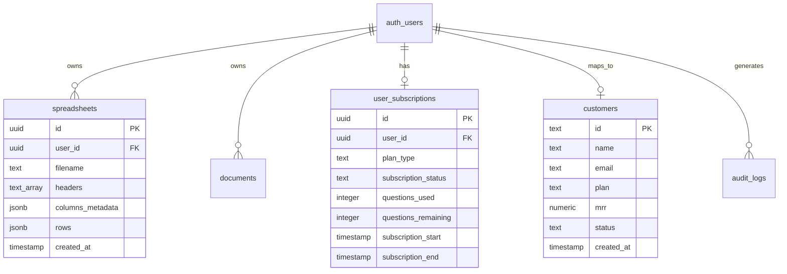

# InsightAI - Database Schema & Data Dictionary

InsightAI uses Supabase PostgreSQL for persistent storage, user authentication management, and row-level security (RLS).

---

## Entity Relationship Summary

---

## Table Definitions

### 1. `spreadsheets`
Stores active uploaded spreadsheet datasets parsed into JSON structure for multi-session persistence.

| Column | Type | Constraints | Description |
| :--- | :--- | :--- | :--- |
| `id` | `uuid` | `PRIMARY KEY, DEFAULT gen_random_uuid()` | Unique spreadsheet identifier |
| `user_id` | `uuid` | `REFERENCES auth.users(id) ON DELETE CASCADE` | Owner user ID |
| `filename` | `text` | `NOT NULL` | Original uploaded file name |
| `headers` | `text[]` | `NOT NULL` | Array of header column names |
| `columns_metadata`| `jsonb` | `NOT NULL` | Map of column types (`metric`, `category`, etc.) |
| `rows` | `jsonb` | `NOT NULL` | Array of data row objects |
| `created_at` | `timestamp` | `DEFAULT timezone('utc', now())` | Upload timestamp |

**RLS Policies**:
- Select/Insert/Delete restricted to `auth.uid() = user_id`.

---

### 2. `user_subscriptions`
Tracks customer plan entitlements, quotas, and expiration windows.

| Column | Type | Constraints | Description |
| :--- | :--- | :--- | :--- |
| `id` | `uuid` | `PRIMARY KEY, DEFAULT gen_random_uuid()` | Record identifier |
| `user_id` | `uuid` | `REFERENCES auth.users(id) ON DELETE CASCADE` | Owner user ID |
| `plan_type` | `text` | `NOT NULL, DEFAULT 'free'` | `free`, `pro`, or `enterprise` |
| `subscription_status`| `text` | `NOT NULL, DEFAULT 'active'` | `active`, `trial_exhausted`, `expired` |
| `questions_used` | `integer` | `DEFAULT 0` | Total AI queries submitted |
| `questions_remaining`| `integer`| `DEFAULT 15` | Remaining queries available |
| `trials_limit` | `integer` | `DEFAULT 10` | Free trial analysis allowance |
| `questions_limit` | `integer` | `DEFAULT 15` | Maximum query quota for tier |

---

### 3. `customers`
Stores customer profile information, current plan tier, and Monthly Recurring Revenue (MRR) metrics.

| Column | Type | Constraints | Description |
| :--- | :--- | :--- | :--- |
| `id` | `text` | `PRIMARY KEY` | Customer or User ID |
| `name` | `text` | `NOT NULL` | Customer or company name |
| `email` | `text` | `NULLABLE` | Contact email address |
| `plan` | `text` | `NOT NULL` | Tier name (`Pro`, `Team`, `Enterprise`) |
| `mrr` | `numeric` | `NOT NULL` | Monthly recurring revenue value |
| `status` | `text` | `NOT NULL` | `Active`, `Pending`, or `Churned` |
| `created_at` | `timestamp` | `DEFAULT timezone('utc', now())` | Account creation timestamp |

---

### 4. Ancillary Analytics Tables (`kpis`, `monthly_metrics`, `plan_distribution`)
- `kpis`: Benchmark platform metrics (`Total Revenue`, `Active Users`, `Churn Rate`, `ARPU`).
- `monthly_metrics`: Historical revenue and MRR timeline points for time-series charts.
- `plan_distribution`: Breakdown percentage across Pro, Team, and Enterprise user plans.
